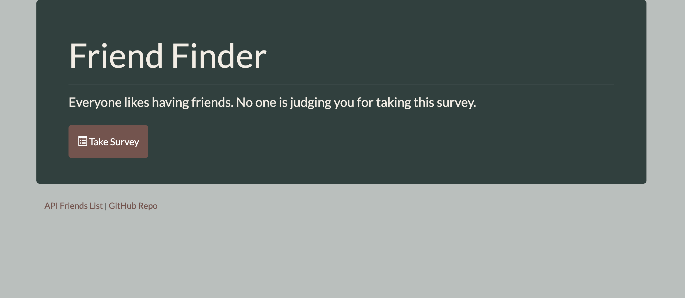
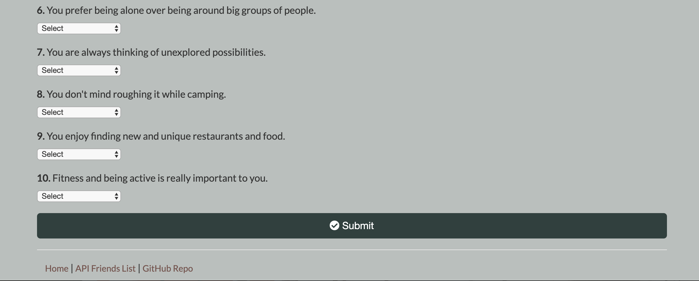

# FriendFinder

**Link to App: https://limitless-headland-33180.herokuapp.com/**

# About:
University of Denver Coding Boot Camp 13th week assignment: This assignmet required us to create a Friend Finder App using Express and Node.js

# How it works:
```
- Friend Finder is an application for finding a friend with like-minded interests.
- The user will fill out a short 10 question survey, their answers will be compared to another user's, it will then return the name and photo of their closest friend match.
```

# Tools + Languages Used:
* HTML
* CSS
* Bootstrap
* JavaScript
* jQuery
* Express.js
* Node.js
* Deployed with Heroku

# Features:


