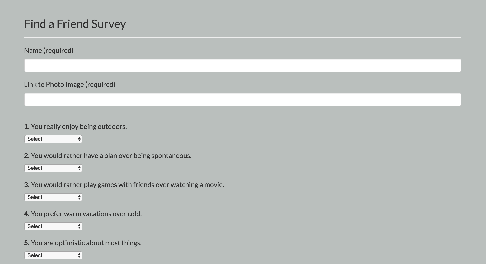

# FriendFinder

**Link to App: https://limitless-headland-33180.herokuapp.com/**

# About:
University of Denver Coding Boot Camp 13th week assignment: Required us to create a Friend Finder App using Express and Node.js

# How it works:
- Friend Finder is a full stack application for finding a friend with like-minded interests.
- The user will fill out a short 10 question survey, their answers will be compared to another user's, it will then return the name and photo of their closest friend match.

# Tools + Languages Used:
## Front-End Technologies:
* HTML - markup language
* CSS - styling 
* Bootstrap - web styling framework (https://getbootstrap.com/)
* JavaScript - programming language
* jQuery - javascript library (https://jquery.com/)

## Back-End Technologies:
* Node.js (https://nodejs.org/en/)
* Express (http://expressjs.com/)
* Deployed with Heroku (https://heroku.com/)

## Installations:
```
npm init
```
```
npm install
```
```
npm install express
```
```
npm install path
```


# Features:



